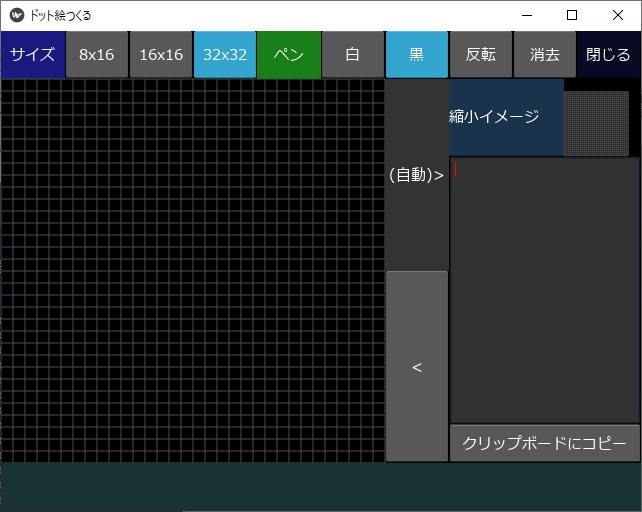
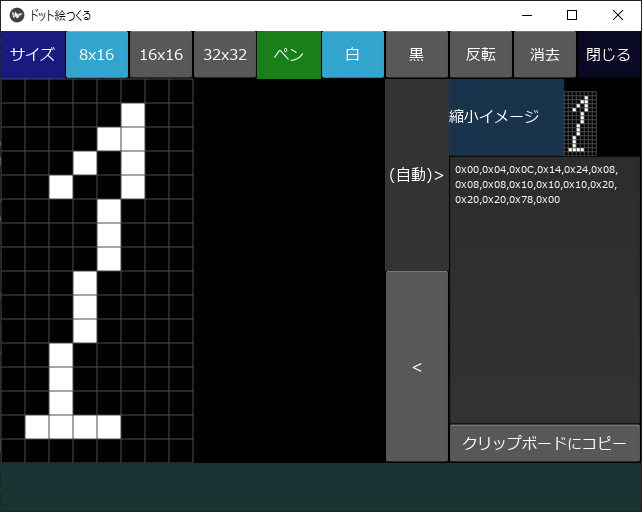
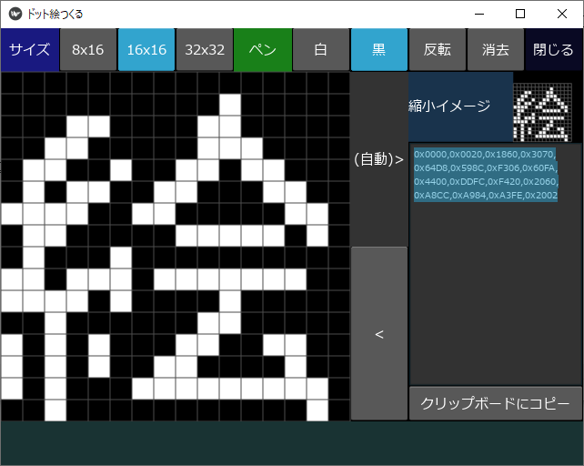
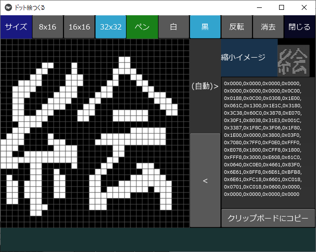
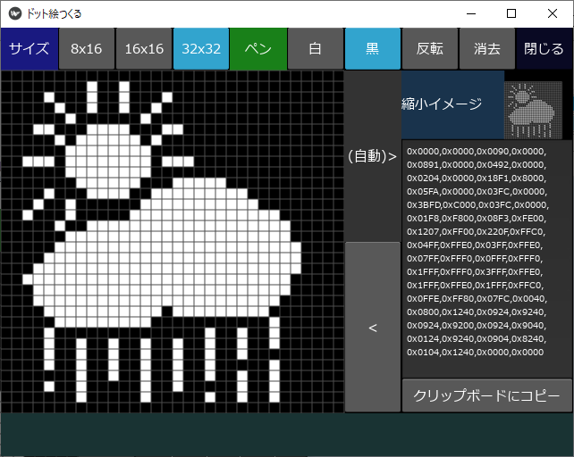
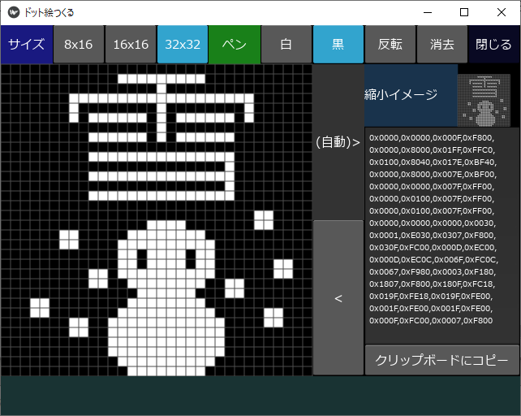
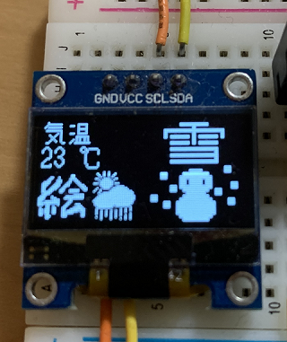
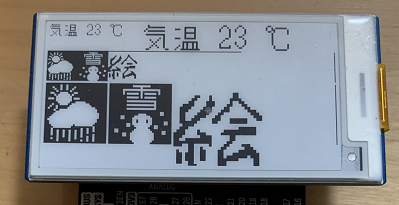

# ドット絵つくる

# 概要
Raspberry Pi Picoに表示させるビットマップ用に作成しました。
- 8x16,16x16,32x32のサイズのドット絵を作成するツールです。
- 作成したデータをファイルに保存したり、ファイルから読み取る機能はありませんが、データをクリップボードにコピーしたり、過去に作成したデータをペーストすることで、ドット絵を表示することができます。
- 各データは、以下のようになっています。
    - 8x16:1byte/行 * 16
    - 16x16:2byte/行 * 16
    - 32x32:(2byte + 2byte)/行 * 32 

# 起動画面
16x16のマトリックスで、起動でします。 
※起動時に、正しくマトリックスが表示されない場合があります。サイズを変更すると解消します。初期処理のタイミングが完全に制御できていないのだと思います。 
画面左側に絵を描きます。そうすると、右側に縮小イメージと16進数のデータが表示されます。 

# 8x16のサイズ

# 16x16のサイズ

# 32x32のサイズ
文字のほか、アイコンの作成を想定しています。 

晴れとくもりと雨のアイコンです。 

雪のマークです。文字とイラストを入れています。 

# 作成したドット情報の使用例
Raspberry Pi Picoで、SSD1306やe-Paperに使用できるようにしています。 

